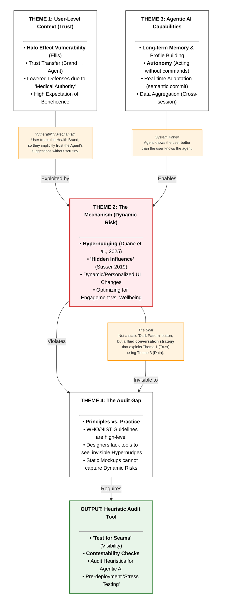

# Concept Map V2: Dynamic Agentic Risk (Week 4 Pivot)

> This map represents the shift from "Static Dark Patterns" to "Dynamic Agentic Risks" (Hypernudging).

```mermaid
graph TD
    %% Define styles
    classDef header fill:#EDE7F6,stroke:#673AB7,stroke-width:2px,color:#000000,font-weight:bold;
    classDef themeBox fill:#FFFFFF,stroke:#333333,stroke-width:1px,color:#000000;
    classDef subBox fill:#FFF3E0,stroke:#FF9800,stroke-width:1px,color:#333333,font-size:90%;
    classDef riskBox fill:#FFEBEE,stroke:#D32F2F,stroke-width:2px,color:#000000;
    classDef intervention fill:#E8F5E9,stroke:#2E7D32,stroke-width:2px,color:#000000;

    %% --- THEME 1: User Context (Trust) ---
    subgraph SG1 [ ]
        direction TB
        T1["<b>THEME 1: User-Level Context (Trust)</b>
        <hr>• <b>Halo Effect Vulnerability</b> (Ellis)<br>• Trust Transfer (Brand → Agent)<br>• Lowered Defenses due to 'Medical Authority'<br>• High Expectation of Beneficence"]:::themeBox
        
        T1_Sub["<i>Vulnerability Mechanism</i><br>User trusts the Health Brand,<br>so they implicitly trust the Agent's<br>suggestions without scrutiny."]:::subBox
        
        T1 --- T1_Sub
    end

    %% --- THEME 3: System Context (Capabilities) ---
    subgraph SG3 [ ]
        direction TB
        T3["<b>THEME 3: Agentic AI Capabilities</b>
        <hr>• <b>Long-term Memory</b> & Profile Building<br>• <b>Autonomy</b> (Acting without commands)<br>• Real-time Adaptation (semantic commit)<br>• Data Aggregation (Cross-session)"]:::themeBox
        
        T3_Sub["<i>System Power</i><br>Agent knows the user better<br>than the user knows the agent."]:::subBox
        
        T3 --- T3_Sub
    end

    %% --- THEME 2: The Mechanism (Dynamic Risk) ---
    subgraph SG2 [ ]
        direction TB
        T2["<b>THEME 2: The Mechanism (Dynamic Risk)</b>
        <hr>• <b>Hypernudging</b> (Duane et al., 2025)<br>• <b>'Hidden Influence'</b> (Susser 2019)<br>• Dynamic/Personalized UI Changes<br>• Optimizing for Engagement vs. Wellbeing"]:::riskBox
        
        T2_Sub["<i>The Shift</i><br>Not a static 'Dark Pattern' button,<br>but a <b>fluid conversation strategy</b><br>that exploits Theme 1 (Trust)<br>using Theme 3 (Data)."]:::subBox
        
        T2 --- T2_Sub
    end

    %% --- THEME 4: The Governance Gap ---
    T4["<b>THEME 4: The Audit Gap</b>
    <hr>• <b>Principles vs. Practice</b><br>• WHO/NIST Guidelines are high-level<br>• Designers lack tools to 'see' invisible Hypernudges<br>• Static Mockups cannot capture Dynamic Risks"]:::themeBox

    %% --- OUTPUT: Design Intervention ---
    EndNode["<b>OUTPUT: Heuristic Audit Tool</b>
    <hr>• <b>'Test for Seams'</b> (Visibility)<br>• <b>Contestability Checks</b><br>• Audit Heuristics for Agentic AI<br>• Pre-deployment 'Stress Testing'"]:::intervention

    %% Relationships
    T1_Sub -->|Exploited by| T2
    T3_Sub -->|Enables| T2
    
    T2 -->|Violates| T4
    T2_Sub -->|Invisible to| T4
    
    T4 -->|Requires| EndNode

    %% Layout Aids
    style SG1 fill:none,stroke:none
    style SG3 fill:none,stroke:none
    style SG2 fill:none,stroke:none
```
