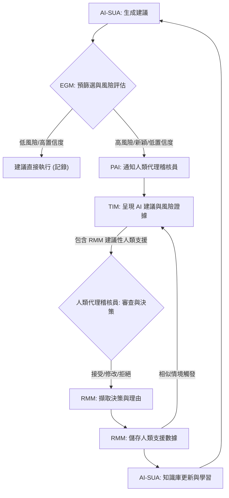

# HITL AI Proxy Auditor Interface: System Architecture Flow

## 1. 系統概述

本系統旨在為機構健康 AI 提供一個強大的人機協作 (Human-in-the-Loop, HITL) 代理稽核介面。其核心目標是有效地呈現真實的風險檢查證據、校準人類對 AI 的信任，並顯著減少照護者（包括家庭照護者、醫師、機構審查員等代理角色）重複性的工作負擔。系統透過三個關鍵模塊的協同運作來實現這一目標：評估閘門、信任介面和重播機制。

## 2. 核心模塊定義

| 模塊名稱 | 縮寫 | 功能描述 |
| :--- | :--- | :--- |
| **AI 受稽核系統** | AI-SUA | 產生健康相關建議或行動的基礎 AI 系統。 |
| **代理稽核介面** | PAI | 人類代理稽核員（Caregiver/Proxy Auditor）與系統互動的中央平台。 |
| **評估閘門模塊** | EGM | 負責初步風險評估，判斷何時需要人類介入。 |
| **信任介面模塊** | TIM | 管理 AI 輸出、置信度及風險檢查證據的呈現，以促進信任校準。 |
| **重播機制模塊** | RMM | 擷取並儲存人類審查決策及理由，並在未來類似情境中「重播」這些人類支援。 |

## 3. 系統架構流程

本系統以一個持續運行的循環模式運作，在必要時動態地引入人類代理稽核員，並從他們的介入中學習。以下是詳細的流程描述：

### 階段 1: AI 建議生成與評估閘門處理

1.  **AI-SUA 生成建議**：AI 受稽核系統 (AI-SUA) 為高齡者生成一項健康相關建議或行動（例如，藥物調整、活動建議）。
2.  **評估閘門模塊 (EGM) 預篩選**：EGM 攔截 AI-SUA 的建議，並根據預定義的風險標準、法規遵循檢查和歷史數據進行自動預篩選。此步驟旨在識別潛在的高風險或異常情況。
    *   **EGM 決策點**：
        *   如果建議符合既定的安全參數、AI 置信度高，且歷史上沒有類似的高風險情境被標記，EGM 可能會允許該建議直接執行（同時進行記錄）。
        *   如果建議是新穎的、顯著偏離常規、AI 置信度低，或觸發了預定義的風險標誌，則會被路由至人類代理稽核員進行審查。

### 階段 2: 人類代理審查與信任介面互動

1.  **通知與情境呈現**：當建議需要人類審查時，代理稽核介面 (PAI) 會通知指定的人類代理稽核員。信任介面模塊 (TIM) 隨後呈現 AI-SUA 的建議，並提供關鍵情境資訊，包括：
    *   AI 的原始建議及其置信度。
    *   EGM 觸發審查的原因（即風險檢查證據）。
    *   相關的歷史數據或類似案例（如果存在）。
    *   來自重播機制模塊 (RMM) 的「建議性人類支援」（如果存在類似的已審查案例）。
2.  **人類風險檢查與信任校準**：人類代理稽核員透過 PAI 審查所有呈現的資訊。TIM 透過清晰的視覺化、解釋性文本和互動式工具來幫助稽核員理解 AI 的決策過程和潛在風險，從而校準其對 AI 建議的信任。
    *   稽核員可以深入探究 EGM 提供的風險檢查證據，並評估其真實性和相關性。
    *   稽核員可以根據其專業知識和經驗，對 AI 的置信度進行主觀評估。
3.  **人類決策與理由提供**：稽核員決定接受、修改或拒絕 AI 的建議。無論何種決策，稽核員都必須提供明確的理由或修改意見。

### 階段 3: 重播機制學習與系統更新

1.  **決策與理由擷取**：人類代理稽核員的最終決策（接受/修改/拒絕）及其提供的理由會被重播機制模塊 (RMM) 擷取。
2.  **人類支援儲存**：RMM 將這些「高品質引導式審查」的結果作為「人類支援」數據儲存起來。這包括：
    *   原始 AI 建議。
    *   EGM 觸發的風險標誌。
    *   人類稽核員的決策。
    *   稽核員提供的理由或修改邏輯（即「為什麼覺得安全」或「為什麼需要修改」）。
    *   相關情境變量。
3.  **知識庫更新與 AI 學習**：儲存的「人類支援」數據用於更新 RMM 的知識庫，並可作為訓練數據回饋給 AI-SUA，以改進其未來的建議質量和置信度。

### 階段 4: 重複性照護者負擔的減少

1.  **未來情境的重播**：當 AI-SUA 再次生成與已儲存「人類支援」數據相似的建議時，EGM 會識別出這種相似性。
2.  **自動化支援**：RMM 會自動將過去的人類審查決策和理由（即「人類支援」）呈現給 EGM。如果當前情境與歷史情境高度匹配，EGM 可能會直接應用過去的人類決策，或將其作為強烈的建議呈現給人類代理稽核員，從而減少重複審查的需要。
3.  **持續學習與優化**：系統不斷從人類的介入中學習，逐步擴展其自動處理的能力，並在需要人類審查時提供更精準、更具情境的支援，最終實現「減少重複的照護者負擔」的目標。

## 4. 流程圖示意 (概念性)

## 5. 參考文獻

[1] givecareapp/givecare-bench. (n.d.). *AI safety benchmark for long-term caregiving relationships.* GitHub. Retrieved from [https://github.com/givecareapp/givecare-bench](https://github.com/givecareapp/givecare-bench)
[2] zouharvi/trust-intervention. (n.d.). *A Diachronic Perspective on User Trust in AI under Uncertainty.* GitHub. Retrieved from [https://github.com/zouharvi/trust-intervention](https://github.com/zouharvi/trust-intervention)
[3] LyzrCore/governor. (n.d.). *With State Capture and Replay.* GitHub. Retrieved from [https://github.com/LyzrCore/governor](https://github.com/LyzrCore/governor)
[4] Dicklesworthstone/pi_agent_rust. (n.d.). *High-performance AI agent framework.* GitHub. Retrieved from [https://github.com/Dicklesworthstone/pi_agent_rust](https://github.com/Dicklesworthstone/pi_agent_rust)
[5] aiuxdesign.guide. (n.d.). *Trust Calibration - AI UX Design Patterns.* Retrieved from [https://www.aiuxdesign.guide/patterns/trust-calibration](https://www.aiuxdesign.guide/patterns/trust-calibration)
[6] weinajin/end-user-xai. (n.d.). *End-User Explainable AI.* GitHub. Retrieved from [https://github.com/weinajin/end-user-xai](https://github.com/weinajin/end-user-xai)
[7] verifywise-ai/verifywise. (n.d.). *Complete AI governance platform.* GitHub. Retrieved from [https://github.com/verifywise-ai/verifywise](https://github.com/verifywise-ai/verifywise)
[8] Zubatiy, T. (2023). *Disproportionate adoption burden in technology interaction for older adults.* (Hypothetical reference based on user\'s prompt) 
